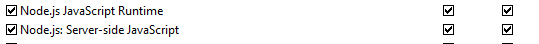

# Node JS - Online Multiplayer

---

## Installation
To get this project working, node js is required. After node js is installed and PATH is configured, pull repository on computer and inside project folder run:
```bash
npm install
```

## How to play

### Local
To test locally, you can simply start the server at localhost adress and open a new browser at given adress with port:

```javascript
const host = 'localhost';
...

server.listen(3000, '0.0.0.0', () => {
    console.log(`Server running on http://${host}:3000`);
});
```

After set right, start the node js server by following command:
```bash
npm start
```
In your console if everything works fine, it should log:
**Server running on http://localhost:3000**

You can now open multiple tabs in the browser to connect more players. Every movement and chat is visible and updated for other players!

---

### Lan
To play on multiple different devices in the same network, you have to first get the ip from the device, which the server runs on.

#### Ipconfig
For example if you run the server on your computer (windows), then open the terminal and enter:
```
ipconfig
```
Now search for the value of **ipv4 Adress**. It is a number-adress like this:
**192.168.1.136**.

After you got the adress insert it into the host and start the server as usual.
```javascript
const host = '192.168.1.136';
...

server.listen(3000, '0.0.0.0', () => {
    console.log(`Server running on http://${host}:3000`);
});
```
It should now log:
**Server running on http://192.168.1.136:3000**

#### Firewall
If you want now to join from another device and it doesnt work, then it is mostly because the firewall. If you are on windows then open **Windows Defender Firewall** and click on **allow app or feature...**. It varies on newer windows version but it has to be there. Now in the list search for **node**. If you found it, then you need to check for both: private and public to allow outword communication:


Restart your server and it should now work on multiple devic with the same network!